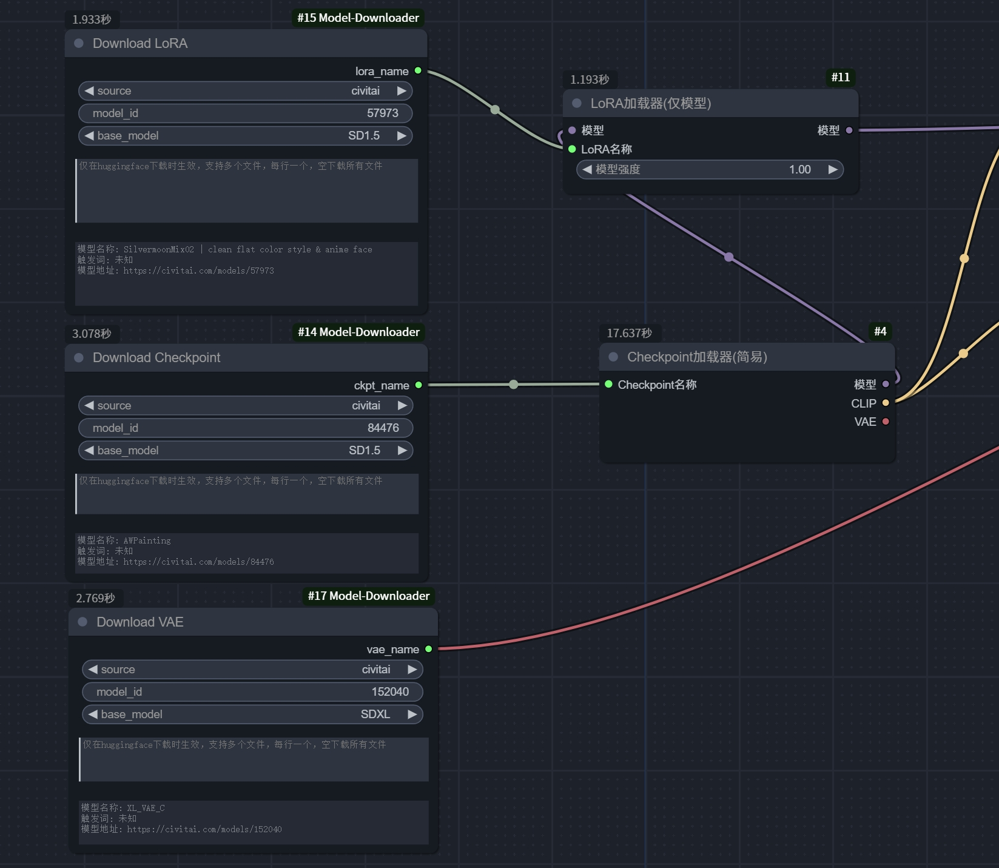

# ComfyUI Model Downloader (ComfyUI 模型下载器)

这是一个用于ComfyUI的模型下载器插件，支持civitai和huggingface下的模型下载，这里更推荐使用civitai，因为civitai提供了更详细的模型信息，包括触发词等。

做这个插件的初衷是让本地下载的模型可以与远端的模型关联上，能够快速的定位到远端的模型。

> 使用过很多工作流，里面选定的模型很多没办法准确定位到是哪个，去哪里下载，有些还是改过名字和存放路径的，给运行这个工作流造成很多困扰，所以想通过这个插件能够准确找到模型在哪，真正可以做到开箱即用。

其可以作为加载模型的前置节点，使分享出去的工作流可以直接运行，而不用关心模型下载的问题。



## 更新日志

### 新增功能

#### 2024-10-29
- **版本选择功能**：现在支持从 Civitai 下载指定版本的模型。用户可以通过 `version_id` 字段指定要下载的版本。如果未指定版本或指定的版本不存在，则默认下载最新版本。
- **文件命名改进**：下载的模型文件和预览图文件名中现在包含版本信息，格式为 `[model_id]model_name_v[version_id]_[version_name].extension`，以便更好地管理和区分不同版本的模型。

## 功能

- 下载Checkpoint模型
- 下载LoRA模型
- 下载VAE模型
- 下载UNET模型
- 下载ControlNet模型

## 安装

1. 克隆此仓库到ComfyUI的`custom_nodes`目录:

```bash
git clone https://github.com/liuqianhonga/ComfyUI-Model-Downloader.git
```

2. 安装依赖:

```bash
pip install -r requirements.txt
```

## 配置

对于需要认证的下载（如 Civitai 的某些模型或 Hugging Face 的私有模型），请按以下步骤配置：

1. 在插件目录下找到 `config.ini.example` 文件。
2. 复制 `config.ini.example` 并重命名为 `config.ini`。
3. 编辑 `config.ini`，填入你的 Civitai API 密钥和/或 Hugging Face 令牌：

```ini
[civitai]
api_key = YOUR_CIVITAI_API_KEY_HERE

[huggingface]
token = YOUR_HUGGINGFACE_TOKEN_HERE
```

4. 保存文件并重启 ComfyUI。

> 注意：请妥善保管你的 API 密钥和令牌，不要将包含这些信息的配置文件分享给他人。

## 使用方法

在ComfyUI中，`添加节点 - Model Download`，您可以使用以下节点:

- Download Checkpoint
- Download LoRA
- Download VAE
- Download UNET
- Download ControlNet

每个下载节点都需要`model_id`和`source`作为输入。如果模型在本地存在,将直接加载;否则,将从指定的源下载。

如果`source`为`civitai`，`model_id`为模型id，如`https://civitai.com/models/123456`，则`model_id`为`123456`。

如果`source`为`huggingface`，`model_id`为模型空间名称，如`https://huggingface.co/models/runwayml/stable-diffusion-v1-5`，则`model_id`为`runwayml/stable-diffusion-v1-5`。

`files_name`仅在huggingface下载时生效，支持多个文件，每行一个，如果为空，则下载所有文件。

下载到的模型会根据`base_model`创建二级目录，如`models/lora/SDXL/`，模型以模型ID+模型名称命名，如`[120096]Pixel Art XL.safetensors`，下载模型的同时会保存一份同名的预览图，如`[120096]Pixel Art XL.png`，但仅`civitai`的模型会有预览图。

## 许可证

MIT